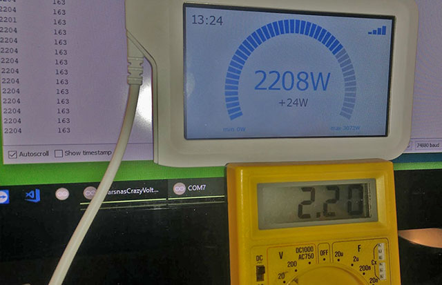

# Make a wireless voltmeter display with IKEA's Sparsnäs

Connect an IR-LED to an ESP8266 and make the LED blink into the Sparsnäs IR-sensor. Now the Sparsnäs is a remote wireless display that can show a number representing whatever you want. 

In this case we measure the voltage on the analog input pin on the ESP8266 and show the voltage on the Sparnsäs display in millivolts. The measuring range on a Wemos D1 mini is roughly from a few millivolts to just over 3000 millivolts. Yup, that's 3 volts if you lost your calculator, hehe. Now... the number will have the letter W tagged on to it on the Sparsnäs display. No, this is not the most serious project you've ever seen.

The setting of "pulses per KWh" in Sparsnäs should be set to 10000.

Accuracy. Well, it's so so. And the display both updates slowly and sometimes fluctuates for no reason. Remember that we are not transmitting the number to display in its native format but as a more "analog" time delay. If necessary you can fine tune both the ADC conversion and the transmission timing of data from the ESP8266 to the Sparsnäs display.

# Prerequisites

- ESP8266
- IR LED
- Resistor 330 Ohm or thereabouts.

Connect the resistor and LED in series. The resistor from 3V3 (NOT ground) to the LED and then the LED to GPIO2 (which equals D4 on the Wemos D1 mini).

# Troubleshooting over serial

The ESP8266 will continously print out the voltage in millivolts and also the current blink timing rate in milliseconds on it's serial/USB interface. Default setting for baudrate is 76800, make sure you set your IDE to this speed.

If your ESP8266 has a built in LED this should also blink every time the IR LED blinks invisibly.

# Have fun
